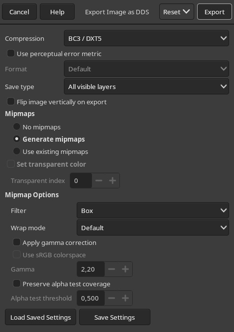

# SkinLib Step-by-Step guide

## Requirements:

- [Raid Lua Dump](https://github.com/steam-test1/Raid-WW2-Lua-Dump)
- [Raid Modding Tools](steam://launch/3115910)
- Image editing software like [Gimp](https://gimp.org)
- Code editor like Notepad++ or VSCode

## Step 0: Decide which weapon you want to create a skin for

| Weapon Name          | Weapon ID   | Weapon Factory ID       |
| :--------------------- | :------------ | ------------------------- |
| PISTOLS              |             |                         |
| C96 Mauser           | c96         | wpn_fps_pis_c96         |
| Tokarev TT-33        | tt33        | wpn_fps_pis_tt33        |
| Parabellum P08       | georg       | wpn_fps_pis_georg       |
| Webley Mk VI         | webley      | wpn_fps_pis_webley      |
| Colt M1911           | m1911       | wpn_fps_pis_m1911       |
| Welrod               | welrod      | wpn_fps_pis_welrod      |
| Pocket Double-Barrel | shotty      | wpn_fps_pis_shotty      |
|                      |             |                         |
| SHOTGUNS             |             |                         |
| M12                  | m1912       | wpn_fps_sho_m1912       |
| Ithaca 37            | ithaca      | wpn_fps_sho_ithaca      |
| Browning Auto-5      | browning    | wpn_fps_sho_browning    |
| Double-Barrel        | geco        | wpn_fps_sho_geco        |
|                      |             |                         |
| SMGS                 |             |                         |
| Sten MkII            | sten        | wpn_fps_smg_sten        |
| Thompson M1A1        | thompson    | wpn_fps_smg_thompson    |
| MP 38                | mp38        | wpn_fps_smg_mp38        |
| Sterling             | sterling    | wpn_fps_smg_sterling    |
|                      |             |                         |
| ASSAULT RIFLES       |             |                         |
| M1 Carbine           | carbine     | wpn_fps_ass_carbine     |
| M1 Garand            | garand      | wpn_fps_ass_garand      |
| StG 44               | mp44        | wpn_fps_ass_mp44        |
|                      |             |                         |
| LMGS                 |             |                         |
| BAR                  | m1918       | wpn_fps_lmg_m1918       |
| Degtyaryov DP-28     | dp28        | wpn_fps_lmg_dp28        |
| Bren                 | bren        | wpn_fps_lmg_bren        |
| MG 42                | mg42        | wpn_fps_lmg_mg42        |
|                      |             |                         |
| SNIPERS              |             |                         |
| Springfield M1903    | m1903       | wpn_fps_snp_m1903       |
| Karabiner 98K        | kar_98k     | wpn_fps_snp_kar_98k     |
| Lee-Enfield          | lee_enfield | wpn_fps_snp_lee_enfield |
| Mosin Nagant         | mosin       | wpn_fps_snp_mosin       |

## Step 1: Extracting nesscessary files

1. Open [Raid Modding Tools](steam://launch/3115910)
2. Point it to your Raid installation folder's bundle.blb (Raid folder/assets/bundle_db.blb)
3. Extract files for your weapon of choice. Those are usually found in `units/vanilla/weapons/WEAPON_FACTORY_ID_pts`, alternatively check the `upd_` folders under `units`. Example for welrod: `units/vanilla/weapons/wpn_fps_pis_welrod_pts`

## Step 2: Editing the textures

1. Open & edit the texture for your skin
2. Export to DDS format, recommended settings (for GIMP):

3. Rename `YourTexture.dds` to `YourTexture.texture`

## Step 3: Writing the code

1. Copy the `skeleton` folder to your `mods` folder and rename it to something unique
2. In the `supermod.xml` edit the `name`, `author`, etc.
3. 

